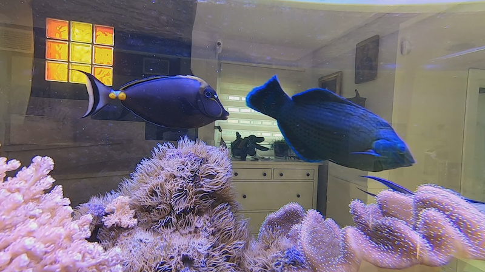
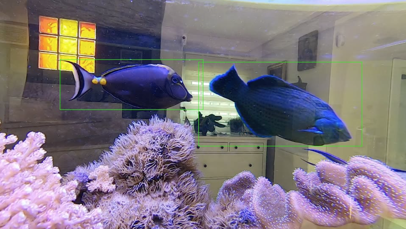
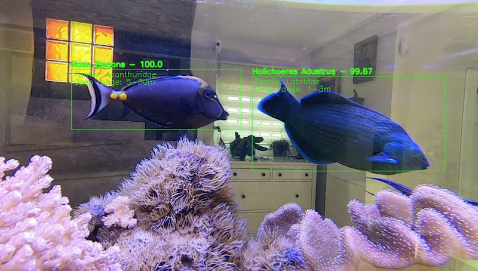

# Augmented Reality Applied to Marine Biology - Degree Final Projecy
## Introduction
Augmented reality, also known as AR, consist in adding layers of information to the real world. This information is added using a medium capable of representing the real world, capturing any picture/video/signal from the real world, preprocessing it and showing it on the medium/device with the new information obtained.

Many application are being developed nowadays using AR for different purposes, like the famous game Pokemon GO.

For this degree's final project, I have developed a first introductory application capable of detecting fishes in images or videos, as well as classify the following species:

* Acanthurus Sohal
* Amphirion Ocellaris
* Coris Formosa
* Halichoeres Adustus
* Naso Elegans
* Naso Vlamingii
* Paracanthurus Hepatus
* Pseudanthias Squamipinnis
* Pterapogon Kauderni
* Siganus Vulpinus
* Sphaeramia Nematoptera
* Zebrasoma Flavescens
* Zebrasoma Veliferum

The previous mentioned species are classified because the application has been tested in a close environment, where these specific species were present. 

The project is based on the algorithm Yolov3 and CNNs.

# Documentation

More information can be found in the PDF, containing everything related to this project. It is written up in spanish.

# Source code

In the folder **scriptsImages** can be found several Python files used to work with images in order to clean and prepare the data used. 

The folder **app** contains the application with all the necessary files.

The weights for the CNN model are present in the **app/darknet** folder names as *cnn_weights.h5*. If you are interested in the weights of the detection YOLO model, contact me to my email mathklimas@gmail.com.

## Example 

